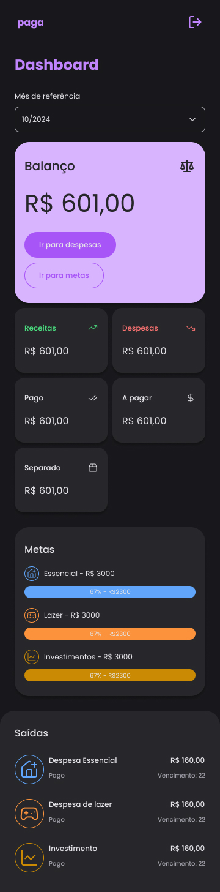

# paga

Bem-vindo ao frontend do **paga**, uma aplicação voltada para organização financeira. O sistema permite gerenciar seus orçamentos mensais, visualizar gastos, receitas e traçar metas de despesas, integrando-se com o backend para exibir os dados de forma estruturada e detalhada.

## 🎯 Objetivo

A aplicação foi criada para estruturar de forma visual e prática os orçamentos financeiros pessoais, resolvendo a limitação de visualizações da planilha no Google Sheets. Com o **paga**, é possível ter acesso detalhado e organizado aos dados financeiros de forma clara e funcional.

## ✨ Funcionalidades

- **Resumo financeiro**:
  - Receita total.
  - Despesas totais.
  - Balanço (receitas - despesas).
  - Valores pagos e valores pendentes.
  - Quantia já separada (reservas).
- **Gestão de despesas**:
  - Controle de metas de gastos.
  - Exibição de valores detalhados por categoria.
- **Login e autenticação**:
  - Acesso seguro via autenticação integrada ao backend.

## 🛠️ Tecnologias utilizadas

- **React.js** com **Vite** para a construção da aplicação.
- **TypeScript** para tipagem e maior segurança no código.
- **Tailwind CSS** e **Shadcn/UI** para estilização.
- **React Router DOM** para gerenciamento de rotas.
- **Zustand** para gerenciamento de estado.

## 🚀 Como rodar o projeto localmente

1. **Clone o repositório**:
   ```bash
   git clone git@github.com:wcardosos/paga-web.git
   cd paga-frontend
   ```

2. **Instale as dependências**:
   ```bash
   npm install
   ```

3. **Configure as variáveis de ambiente**:
   - Copie o arquivo `.env.sample` para `.env`:
     ```bash
     cp .env.sample .env
     ```
   - Preencha as variáveis de ambiente conforme suas configurações.

4. **Execute o servidor em ambiente de desenvolvimento**:
   ```bash
   npm run dev
   ```

## 📸 Prints da aplicação

Aqui estão alguns exemplos visuais da aplicação:

<!-- Adicione seus prints abaixo -->




Os prints estão disponíveis na pasta `docs/screenshots`.

## ⚠️ Contribuições

Contribuições não estão sendo aceitas no momento.

## 🗒️ Licença

Este projeto ainda não possui uma licença definida.

---

🎉 **Obrigado por utilizar o paga!** Caso tenha alguma dúvida, fique à vontade para entrar em contato. Acesse também a API da aplicação em https://github.com/wcardosos/paga-bff.